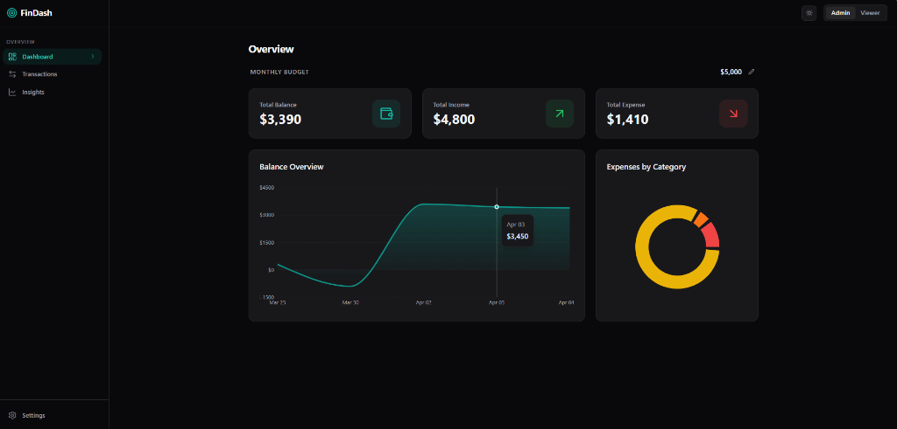
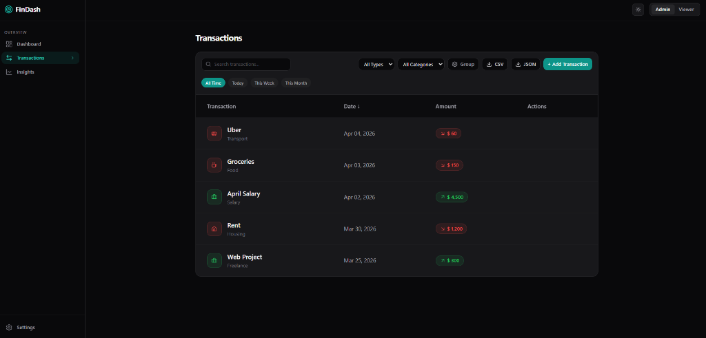
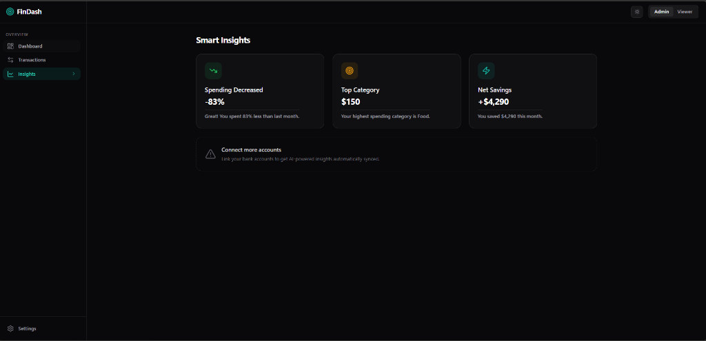
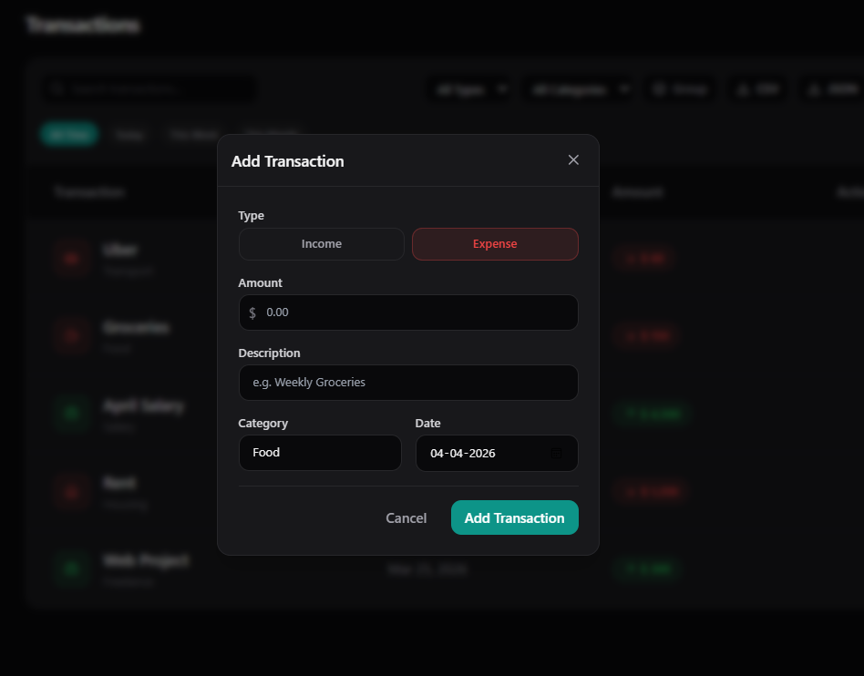

# Finance Dashboard 📈

A premium, production-ready Finance Dashboard built with **React, TypeScript, and Tailwind CSS**. This project demonstrates clean architecture, scalable state management, and thoughtful UI/UX inspired by modern fintech applications.

## 📸 Screenshots






## 🚀 Overview

The goal of this project was to build a visually engaging, intuitive, and responsive dashboard that doesn't just look good, but is structured like a real-world enterprise application. Instead of over-engineering with complex abstractions, the focus is on a scalable, feature-based modular structure that can be easily extended.

## 🛠 Tech Stack

- **Framework**: Vite + React
- **Language**: TypeScript for end-to-end type safety.
- **Styling**: Tailwind CSS for rapid, scalable utility-based styling with a custom `zinc-950` premium dark mode palette.
- **State Management**: Zustand — Chosen over Redux to reduce boilerplate while keeping state logic simple, fast, and close to components.
- **Micro-interactions**: Framer Motion — Subtle, meaningful animations (card hovers, modals, layout transitions) that make the app feel alive.
- **Data Visualization**: Recharts — Customized with smooth curves, gradient fills, and clean tooltips, optimizing for chart readability by minimizing grid noise.
- **Icons**: Lucide React
- **Date Formatting**: `date-fns`

## 📁 Architecture

Uses a *Feature-Based Modular Architecture* to ensure clear separation of concerns without over-centralization:

```text
src/
├── components/
│   ├── ui/          # Reusable dumb components (Card, Button, Badge)
│   └── layout/      # App layout components (Sidebar, Header, MainLayout)
├── features/
│   ├── dashboard/   # Dashboard charts and summary widgets
│   ├── transactions/# Transaction table, filters, sorting logic
│   └── insights/    # Smart analytics cards
├── store/           # Zustand global state (useFinanceStore)
├── types/           # Global TypeScript interfaces
└── utils/           # Shared helpers (e.g. `cn` class merger)
```

## ✨ Key Features

1. **Premium Dashboard Overview**
   - Animated summary cards for Balance, Income, and Expenses.
   - Beautiful smooth-curve line charts and category breakdown donut charts.
2. **Advanced Transactions Table**
   - Functional filtering (by type, category, and text search) and sorting (by date, amount).
   - Sticky headers, colored status badges, category icons, and meaningful empty states.
3. **Smart Insights**
   - Visual cards automatically calculated based on the data, highlighting spending increases, top categories, and savings rates.
4. **Data Management**
   - Robust persistent local-storage integration configured via Zustand.
   - Built-in Mock API handling showcasing async latency UX and Skeleton Loaders.
   - 1-Click native JSON / CSV data exports on filtered categories.
5. **Role-Based Simulation (Auth UI)**
   - Header toggle to switch between `Admin` and `Viewer` modes.
   - Viewers see conditional UI: edit/delete actions are disabled contextually with helpful tooltips ("Only admins can modify transactions") rather than just hiding the elements abruptly.

## 💻 Getting Started

### Prerequisites
- Node.js `v18+`
- npm or yarn

### Setup

```bash
# 1. Clone the repository
git clone https://github.com/akshaydubey026/finance-dashboard.git
cd finance-dashboard

# 2. Install dependencies
npm install

# 3. Start the development server
npm run dev
```

Visit `http://localhost:5173` to view the application.

## 🔮 Future Improvements

- Link to real backend APIs (e.g., Node.js/Express with PostgreSQL).
- Implement Plaid API integration for automatic bank transaction syncing.
- Containerize the frontend with Docker for CI/CD.

---
*Built with ❤️ Akshay*
